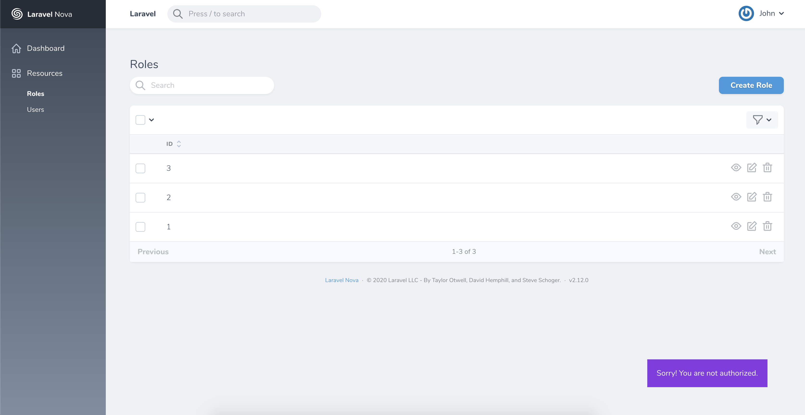

# Nova toasted

A package to customize your Laravel Nova toasted notifications.

## Instalation

```shell
composer require skoyah/nova-toasted
```

```shell
php artisan vendor:publish --tag=nova-toasted
```

After publishing the assets, in your `config` folder there's now a `toasted.php` file with the default options used by Nova and the Toasted plugin itself. Feel free to change them according to your needs. For more information about this values, check the [toasted documentation](https://github.com/shakee93/vue-toasted#api)

The `toasts` key is where you will register all custom toasted components for your application:

```php
    'toasts' => [
        [
            'name' => 'forbidden',
            'message' => 'Sorry! You are not authorized.',
            'options' => [
                'type' => 'error',
                'duration' => 2000,
            ],
        ],
    ],
```

---

## Usage

After registering the components, you are able to use them globally, with one of the following forms:

```javascript
this.$toasted.forbidden(); //inside vue components

Nova.bus.$toasted.forbidden(); //globally available
```

Additionaly, you can still use custom messages and options for a particullar situation:

```javascript
this.$toasted.forbidden('Access denied.', { duration: 5000 });
```

---

## Styling

To style your custom theme and toasted components and to override the default ones, in you css file:

```css
/* styling your custom theme */
.my-custom-theme {
  //...
}

/* use this classes override default components */
.toasted.default {
  //...
}

.toasted.success {
  //...
}

.toasted.error {
  //...
}

.toasted.info {
  //...
}

.toasted.warning {
  //...
}

/* custom components */
.toasted.forbidden {
  //...
}
```

### Example

```css
.my-theme {
  padding: 20px !important;
  color: white;
}

.toasted.forbidden {
  background-color: blueviolet;
}
```


